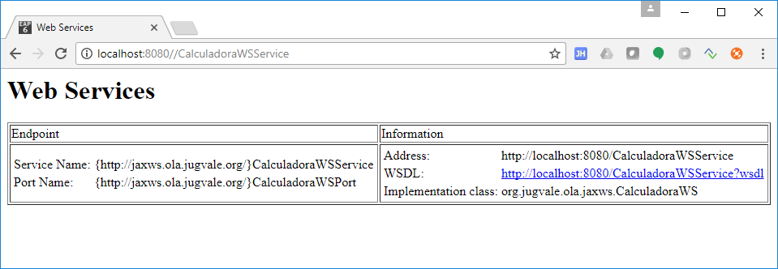
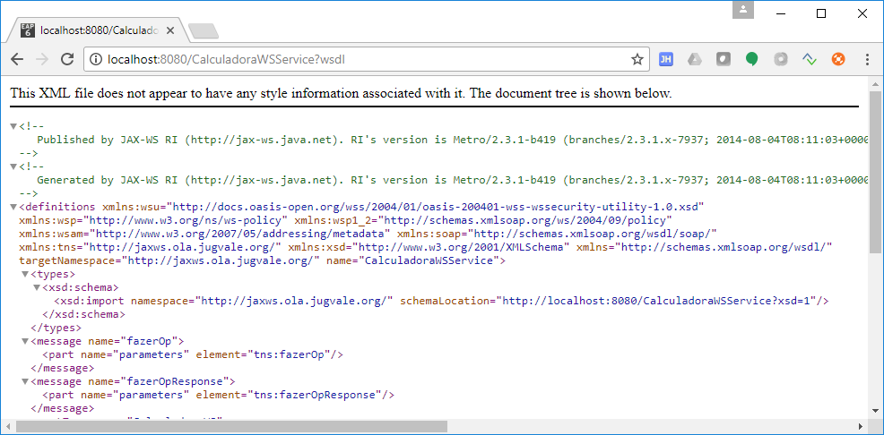
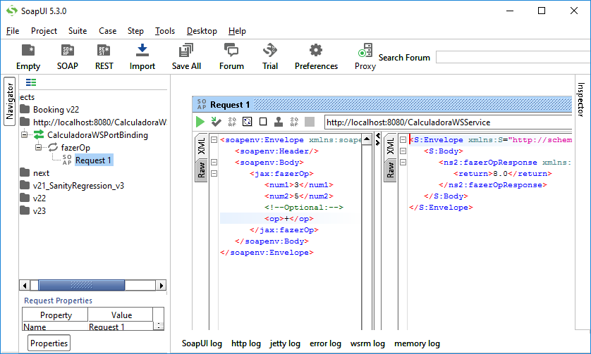

# Java SOAP Service

SOAP service for my demonstration.


# Prerequisites

1. [Java](http://www.oracle.com/technetwork/java/javase/downloads/jdk8-downloads-2133151.html) 8+
2. [Maven](https://maven.apache.org) 3+


# How to run

Clone

```
git clone https://github.com/humbertodias/java-soap-demo
```

Inside

```
cd java-soap-demo
```

Run

```
mvn package
mvn embedded-glassfish:run -Dhttp.port=8080
```


Output

```
-------------------------------------------------------
 T E S T S
-------------------------------------------------------
INFO: Webservice Endpoint deployed CalculadoraWS
 listening at address at http://localhost:8080//CalculadoraWSService.
jun 07, 2017 6:16:59 PM org.glassfish.webservices.metroglue.MetroContainer deployWsTxServices
INFO: Loading WS-TX Services. Please wait.
jun 07, 2017 6:16:59 PM org.glassfish.webservices.metroglue.MetroContainer deployWsTxServices
WARNING: Cannot deploy or load WS-TX Services: Required WAR file (wstx-services.war) is not installed
jun 07, 2017 6:16:59 PM com.sun.enterprise.web.WebApplication start
INFO: Loading application [calculadora-jax-ws] at [/]
jun 07, 2017 6:16:59 PM org.glassfish.deployment.admin.DeployCommand execute
INFO: calculadora-jax-ws was successfully deployed in 1.808 milliseconds.
jun 07, 2017 6:16:59 PM PluginUtil doDeploy
INFO: Deployed calculadora-jax-ws
Hit ENTER to redeploy, X to exit
```


Endpoint

[http://localhost:8080/CalculadoraWSService](http://localhost:8080/CalculadoraWSService)



WSDL

[http://localhost:8080/CalculadoraWSService?wsdl](http://localhost:8080/CalculadoraWSService?wsdl)



Client

SoapUI > SOAP > Initial WSDL > [http://localhost:8080/CalculadoraWSService?wsdl](http://localhost:8080/CalculadoraWSService?wsdl)




# References

[Maven plugin for GlassFish](https://jinahya.wordpress.com/2015/04/23/using-maven-embedded-glassfish-plugin-4-x/)

[WebServices SOAP with JAX-WS](http://aprendendo-javaee.blogspot.com.es/2014/01/introducao-web-services-soap-com-jax-ws.html)

